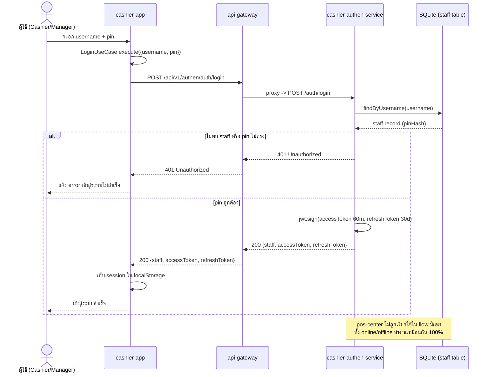

# Login — offline mode / online mode

[← กลับไปหน้ารวม](./README.md)

Login เป็น local-only เสมอ ตรวจสอบ username/pin กับ SQLite ของ `cashier-authen-service` โดยตรง **ไม่มีการเรียก pos-center ใน flow นี้เลย** ไม่ว่าจะออนไลน์หรือออฟไลน์ผลลัพธ์จึงเหมือนกันทุกประการ (เพราะ staff ถูก provision ไว้ในเครื่อง local ล่วงหน้าแล้วตอน onboard/create staff)

**Config `APP_MODE`:** ไม่เกี่ยวข้องกับ flow นี้ — `cashier-authen-service` ไม่มีการเรียกออกไปหา `pos-center` เลย จึงไม่มีอะไรให้ gate ด้วย mode

