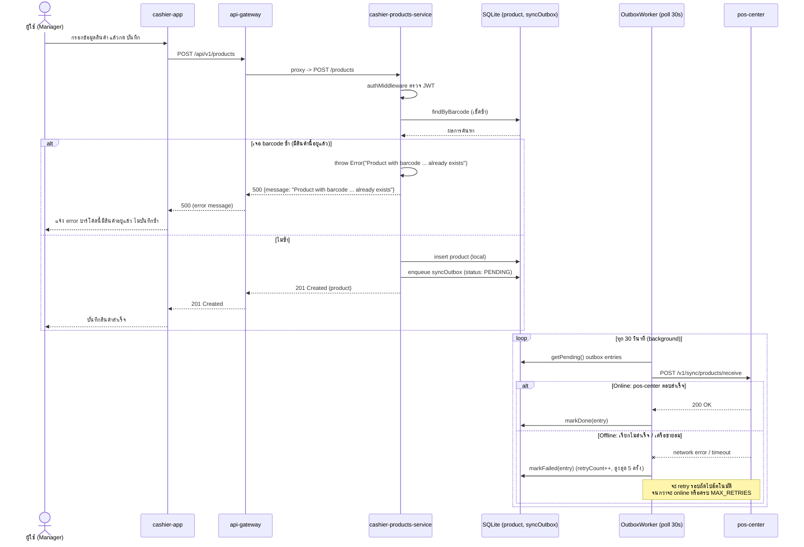

# Product — create — offline mode / online mode

[← กลับไปหน้ารวม](./README.md)

ส่วนหน้าบ้าน (foreground) เหมือนกันทั้ง offline/online: บันทึกสินค้าลง SQLite local แล้วตอบกลับผู้ใช้ทันที พร้อมกับ enqueue รายการเข้า `syncOutbox` การ sync ไป `pos-center` เกิดขึ้นภายหลังโดย `OutboxWorker` (poll ทุก 30 วินาที) — จุดนี้คือจุดที่ offline/online แยกออกจากกัน

**Config `APP_MODE` (`cashier-products-service/.env`):** `online` (default) เริ่ม `OutboxWorker` ตามปกติ, `offline` จะไม่เริ่ม worker เลย (ไม่มีการพยายามยิงออก `pos-center` แม้แต่ครั้งเดียว) รายการใน `syncOutbox` ยังถูก enqueue ตามปกติและรอ sync เมื่อรีสตาร์ทเซอร์วิสเป็นโหมด `online`

**กรณีเช็คแล้วซ้ำ (barcode ซ้ำ):** `CreateProductUseCase` เช็คด้วย `findByBarcode` ก่อนเสมอ ถ้าพบว่ามีสินค้าที่ barcode นี้อยู่แล้วจะ `throw Error` ทันที **ไม่ insert ซ้ำ และไม่ enqueue เข้า syncOutbox** — ปัจจุบันโค้ด catch เป็น error ทั่วไปแล้วตอบกลับเป็น `500` (ไม่ได้แยกเป็น `409 Conflict` ตามหลัก REST) ฝั่ง `cashier-app` จึงต้องอ่านจาก `message` เพื่อนำไปแสดงผู้ใช้ว่าเป็นกรณีข้อมูลซ้ำ

