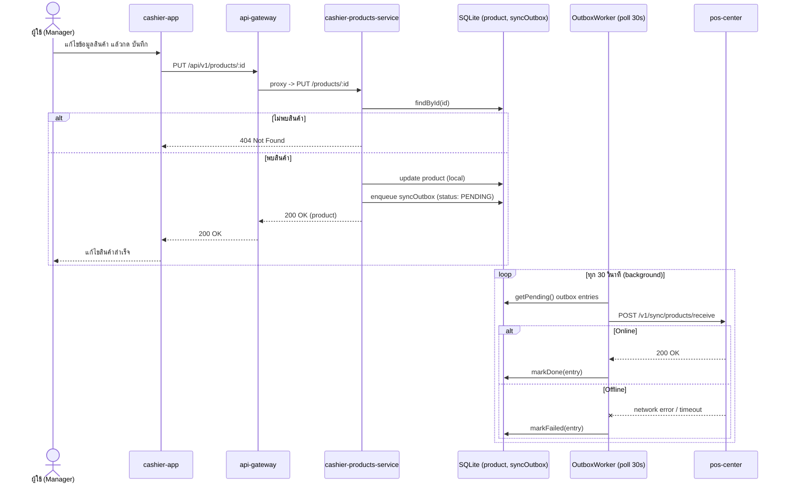

# Product — edit — offline mode / online mode

[← กลับไปหน้ารวม](./README.md)

รูปแบบเดียวกับ "[product create](./02-product-create.md)" ทุกประการ ต่างกันแค่เป็นการ update แทน insert รวมถึง config `APP_MODE` ก็ตัวเดียวกัน (ใช้ `OutboxWorker` ร่วมกันในเซอร์วิสเดียวกัน)

