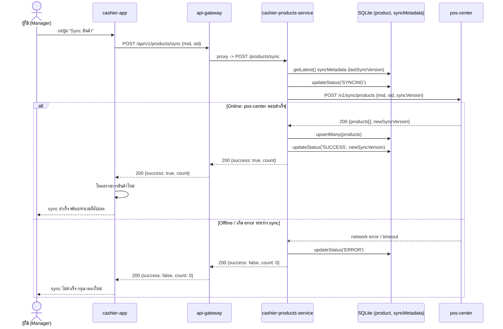

# Product — sync — online mode

[← กลับไปหน้ารวม](./README.md)

ทิศทางตรงข้ามกับ create/edit: ดึงข้อมูลสินค้าจาก `pos-center` เข้ามาที่เครื่อง local (pull) สั่งงานด้วยตนเองผ่านปุ่ม "Sync" บนหน้าจอ ต้องออนไลน์เท่านั้น หากล้มเหลวจะถือเป็นความล้มเหลวของการ sync ครั้งนั้น (ไม่มี fallback แบบ offline)

**Config `APP_MODE` (`cashier-products-service/.env`):** ถ้าตั้งเป็น `offline` `SyncProductsUseCase` จะไม่พยายามยิง HTTP ไป `pos-center` เลย ตอบกลับ `{success: false, count: 0}` ทันทีพร้อม set สถานะ `ERROR` (ต่างจากตอน online-แต่-เน็ตล่ม ที่ยังพยายามยิงจริงก่อนถึงจะ fail)

