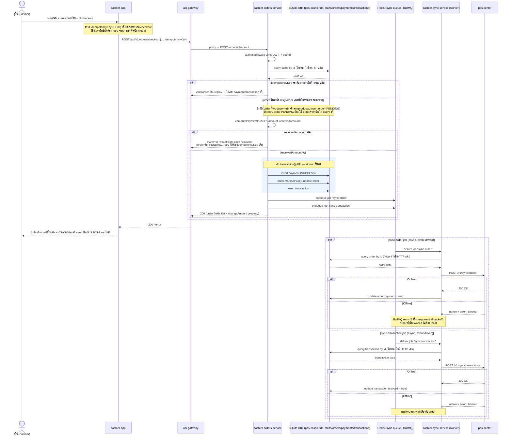

# Sell (ขายสินค้า) — create/checkout — offline mode / online mode

[← กลับไปหน้ารวม](./README.md)

ส่วนหน้าบ้านทั้งหมด (สร้าง order, ประมวลผลชำระเงิน, สร้าง transaction) เป็น local-only และตอบกลับ "ขายสำเร็จ" ให้ผู้ใช้ทันที โดยไม่รอ pos-center

**อัปเดต (สำคัญ):** เดิม `cashier-orders-service` ยิง HTTP เรียก `cashier-authen-service` (staff lookup), `cashier-payment-service` (payment), `cashier-transactions-service` (transaction) แยกเป็น 3 เซอร์วิส ผ่าน route ภายใน (`/internal/...`) — ตอนนี้ **รวม logic ทั้งหมดเข้ามาอยู่ใน `cashier-orders-service` แล้ว** เพราะทุกเซอร์วิสใช้ SQLite ไฟล์เดียวกันจริง (`pos-cashier.db` ที่ root repo ผ่าน `createDatabase()` จาก `@lightning-pos/database`) การยิง HTTP ข้าม process จึงเป็นภาระที่ไม่จำเป็นและเป็นจุดที่ทำให้เกิด partial-failure (payment สำเร็จแต่ transaction สร้างไม่สำเร็จ ก็ไม่มีทาง rollback)

`CheckoutUseCase` ตอนนี้:
1. query staff โดยตรงจากตาราง `staffs` (ผ่าน `SqliteStaffServiceImpl`, ไม่มี HTTP)
2. **ถ้า client ส่ง `idempotencyKey` มา ให้เช็คก่อนเลยว่ามี order ที่ใช้ key นี้อยู่แล้วหรือไม่** (ดูหัวข้อ idempotency ด้านล่าง) — ถ้ามีและจ่ายสำเร็จแล้ว (`PAID`) ให้ return order เดิมทันที ไม่แตะ payment/transaction ซ้ำ
3. **query ราคาสินค้าจริงจากตาราง `products` ด้วย `productId` ที่ client ส่งมา** — ไม่เชื่อ `price` จาก client เลย (แก้ช่องโหว่ price tampering เดิม) ถ้า `productId` ไหนหาไม่เจอจะ throw `NotFoundError` ทันที (ข้ามขั้นนี้ถ้า reuse order เดิมจาก idempotency key)
4. insert order (`PENDING`) ด้วยราคาที่ query ได้ พร้อม `idempotencyKey` (ถ้ามี)
5. คำนวณผลการชำระเงิน (`computePayment` — logic เดิมของ `ProcessPaymentUseCase` ย้ายมาเป็น private method, **รองรับแค่ `CASH` เท่านั้น** ดูหัวข้อด้านล่าง)
6. **insert payment + update order เป็น `PAID` + insert transaction ทั้งหมดอยู่ใน DB transaction เดียว** (`this.db.transaction(...)`) — ถ้าขั้นไหนพังกลางทาง ทุกอย่าง rollback ทั้งหมด ไม่มีสถานะค้างครึ่งๆ กลางๆ อีกต่อไป
7. หลัง transaction commit สำเร็จ ค่อย enqueue `sync-order`/`sync-transaction` เข้า BullMQ

**Idempotency (`orders.idempotency_key`, unique+nullable):** `cashier-app` สร้าง UUID เดียวต่อการกด checkout 1 ครั้ง (`checkoutIdempotencyKeyRef` ใน `CreateOrderPage.tsx`) แล้วใช้ key เดิมซ้ำถ้าต้อง retry คำขอเดิม (network timeout, double-submit) จนกว่าจะ checkout สำเร็จหรือปิด modal — ฝั่ง backend:
- ถ้าพบ order เดิมที่ `PAID` แล้ว → return ผลเดิมทันที (replay) ไม่ชาร์จซ้ำ ไม่สร้าง transaction ซ้ำ
- ถ้าพบ order เดิมที่ยังเป็น `PENDING` (ความพยายามก่อนหน้าล้มเหลวก่อนถึงขั้น payment เช่น received amount ไม่พอ) → ใช้ order แถวเดิม retry payment ต่อ แทนที่จะสร้าง order ใหม่ซ้ำ
- ถ้าไม่ส่ง key มาเลย → behavior เดิม สร้าง order ใหม่ทุกครั้ง (ไม่แนะนำ)

`CalculateOrderUseCase` (endpoint preview ราคาก่อนกด checkout, `POST /api/v1/orders/calculate`) ก็แก้ให้ query ราคาจริงจาก `products` เหมือนกันแล้ว เพื่อให้ยอด preview ตรงกับยอดที่ถูก charge จริงตอน checkout เสมอ

**อัปเดต (สำคัญ #2 — ลบ `cashier-payment-service` ทิ้งทั้งเซอร์วิส):** หลังย้าย payment logic เข้า orders-service แล้ว ไม่มีใครเรียก `cashier-payment-service` อีกเลย (ทั้ง internal route ที่ลบไปแล้ว และ public `POST /api/v1/payment` ก็ไม่มี frontend เรียกจริง) จึงลบทั้งโฟลเดอร์ `apps/cashier-payment-service` และ route proxy `/api/v1/payment` ใน `cashier-api-gateway` ทิ้งไปเลย — ระบบตอนนี้เหลือ 8 เซอร์วิส (ไม่รวม payment-service แล้ว)

**อัปเดต (สำคัญ #3):** `cashier-sync-service` ก็ถูกย้ายให้ query/update DB โดยตรงเช่นกัน (`SqliteOrderRepositoryImpl`, `SqliteTransactionRepositoryImpl`) แทนที่จะยิง HTTP ไปหา `cashier-orders-service`/`cashier-transactions-service` — ตอนนี้ **ไม่มี cross-service HTTP call เหลืออยู่เลยในระบบ** (ยกเว้นการเรียกออกไปหา `pos-center` ซึ่งเป็น external system ที่ตั้งใจให้เป็น HTTP อยู่แล้ว) ไฟล์ที่ถูกลบ: `ApiOrderRepositoryImpl`/`ApiTransactionRepositoryImpl` (sync-service), route `GET/PATCH /internal/v1/orders/:id...` ทั้งหมด (orders-service, พร้อม `GetOrderByIdUseCase`/`MarkOrderSyncedUseCase`), route `POST/GET/PATCH /internal/v1/transactions...` ทั้งหมด (transactions-service, พร้อม `MarkTransactionSyncedUseCase`) — ส่วนการ enrich receipt ด้วยชื่อสินค้า/order items ใน `GetTransactionByIdUseCase` ก็เปลี่ยนมา query ตรงจาก `orderItems`/`products` table แทนเช่นกัน (`SqliteOrderServiceImpl`, `SqliteProductServiceImpl`)

ไฟล์ที่ถูกลบไปก่อนหน้านี้เพราะไม่มีใครเรียกใช้แล้ว: `ApiStaffServiceImpl`, `ApiPaymentServiceImpl`, `ApiTransactionServiceImpl` (orders-service), route `GET /internal/v1/staffs/:id` (authen-service), route `POST /api/v1/payment/internal` (payment-service, ก่อนที่จะลบทั้งเซอร์วิสในขั้นต่อมา), route `POST /internal/v1/transactions` (transactions-service, พร้อม `CreateTransactionUseCase`/`TransactionIdGeneratorImpl`)

การ sync order/transaction ไป pos-center ยังทำผ่าน BullMQ queue (`sync-queue`) ที่ `cashier-sync-service` consume แบบ event-driven เหมือนเดิม — จุดนี้ยังคงเป็นจุดที่ offline/online แยกออกจากกัน

**อัปเดต (สำคัญ #4 — รองรับแค่ CASH เท่านั้น):** `CREDIT_CARD`/`QR_CODE` ถูกตัดออกจากระบบทั้งหมดแล้ว (ยังไม่มี payment-gateway integration จริง เคยค้าง `PENDING` ตลอดไปแบบไม่มี webhook มา confirm) — `computePayment()` รับแค่ `paymentMethod: 'CASH'` เท่านั้น ถ้า client ส่งค่าอื่นมาจะ throw error `Payment method X is not supported at this time` ทันทีตั้งแต่ก่อนเขียนอะไรลง payment/transaction เลย (`PaymentMethod` type ฝั่ง orders-service และ `ApiOrderRepository` ฝั่ง frontend ก็ถูกจำกัดให้เป็น `'CASH'` type เดียวแล้วเช่นกัน) checkout ตอนนี้จึงมีแค่ 2 ผลลัพธ์: **สำเร็จ (`PAID`)** หรือ **throw error** ไม่มีสถานะ `PENDING` ค้างจาก payment อีกต่อไป (order จะเป็น `PENDING` ได้แค่ชั่วคราวระหว่างรอ insert payment เท่านั้น หรือค้างถาวรถ้า `computePayment` throw เช่น received amount ไม่พอ ซึ่ง client แก้แล้ว retry ด้วย idempotencyKey เดิมได้)

**Config `APP_MODE` (`cashier-orders-service`):** ไม่มีผลกับ flow นี้เลย — enqueue เข้า `sync-queue` (Redis) เกิดขึ้นเสมอไม่ว่าจะ mode ไหน เพราะ checkout เป็น local-only อยู่แล้ว

**Config `APP_MODE` (`cashier-sync-service/.env`):** จุดที่ mode มีผลจริงคือฝั่งนี้ — `online` (default) จะ start BullMQ worker เพื่อ consume job `sync-order`/`sync-transaction` และยิงไป `pos-center`, `offline` จะไม่ start worker เลย งานที่ enqueue ไว้จะค้างอยู่ใน Redis queue จนกว่าจะรีสตาร์ทเซอร์วิสเป็นโหมด `online` (ต่างจาก BullMQ retry ปกติที่ยิงจริงแล้ว fail ค่อย retry)

