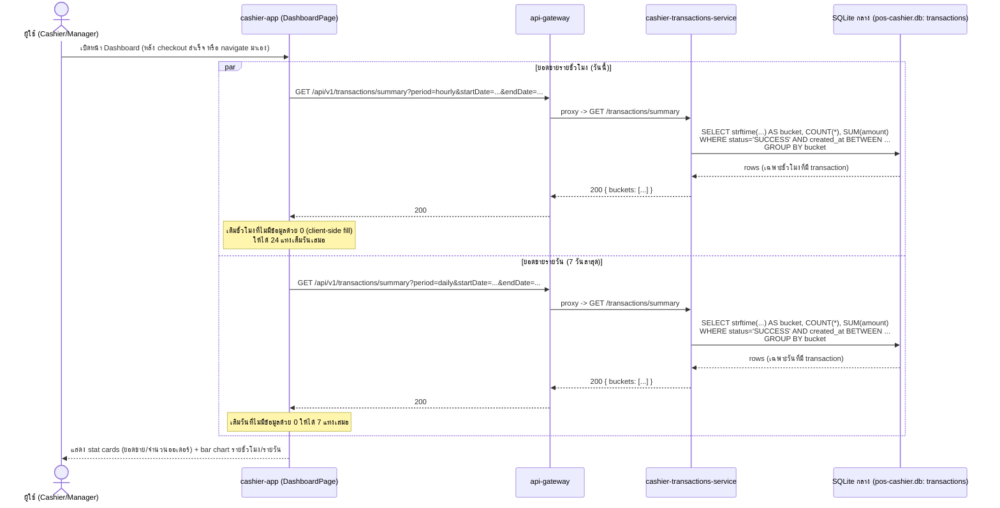

# Transaction Summary (สรุปยอดขาย) — hourly / daily — read-only

[← กลับไปหน้ารวม](./README.md)

หลัง checkout สำเร็จ (ดู [05-sell-checkout.md](./05-sell-checkout.md)) ผู้ใช้ (cashier/manager) ต้องการเห็นสรุปยอดขายแบบรายชั่วโมงและรายวันบนหน้า Dashboard ของ `cashier-app` flow นี้เป็น **read-only aggregation query** แยกออกจาก checkout flow โดยสิ้นเชิง — ไม่แตะ write path ของการขาย ไม่มีการเขียนตารางใหม่ และไม่ผูกกับ transaction เดียวของ checkout ใดๆ

**ทำไมไม่สร้างตาราง summary แยก:** ปริมาณ transaction ต่อร้านต่อวันของ POS อยู่ในระดับที่ query แบบ `GROUP BY` สดจากตาราง `transactions` เร็วพอ (ไม่ต้อง index/materialize เพิ่ม) การมีตาราง summary แยกจะต้องอัปเดตมันในทรานแซกชันเดียวกับ checkout (`CheckoutUseCase`'s `db.transaction()`) ซึ่งเพิ่มความเสี่ยงข้อมูลสองชุดไม่ตรงกัน (โดยเฉพาะกับระบบ offline-first ที่พึ่ง idempotency/retry อยู่แล้ว) — ให้พิจารณาเพิ่มตาราง materialized เฉพาะเมื่อมีการลบ/archive ข้อมูลเก่าและยังอยากเก็บยอดสรุปย้อนหลัง หรือปริมาณข้อมูลโตจนกระทบ performance จริง

## Endpoint

`GET /api/v1/transactions/summary?period=hourly|daily&startDate=...&endDate=...&storeId=...` (ผ่าน `api-gateway` proxy ไปยัง `cashier-transactions-service`)

- `period`: `hourly` group ด้วย `strftime('%Y-%m-%d %H:00', created_at, 'unixepoch', 'localtime')`, `daily` group ด้วย `strftime('%Y-%m-%d', created_at, 'unixepoch', 'localtime')` — ใช้ `'localtime'` ของเครื่องที่รัน service (สมมติฐานเดียวกับ `TransactionListPage` ที่ fix เป็น `Asia/Bangkok` ฝั่ง frontend เพราะระบบเป็น local-first รันอยู่ที่ร้านจริง ไม่ใช่ cloud หลายโซนเวลา)
- นับเฉพาะ transaction ที่ `status = 'SUCCESS'`
- Route `/summary` ถูก register ก่อน `/:id` ใน `transactionRoutes.ts` เพื่อไม่ให้ Express จับคำว่า `summary` เป็น transaction id

Response: `{ buckets: [{ bucket: string; orderCount: number; totalAmount: number }] }`

## Sequence

## หมายเหตุ

- Flow นี้ไม่ผูกกับ checkout แบบ synchronous — Dashboard fetch ข้อมูลนี้เองตอนเปิดหน้า ไม่ใช่ checkout ที่ trigger คำนวณ summary ทันทีที่ขายสำเร็จ เพื่อไม่ให้ latency/failure ของ reporting กระทบ checkout path ที่ตั้งใจให้ atomic และเร็วที่สุด
- ไม่มีผลกับ sync ไป `pos-center` — endpoint นี้อ่านจาก SQLite local เท่านั้น ไม่เกี่ยวกับ BullMQ queue/`cashier-sync-service`
