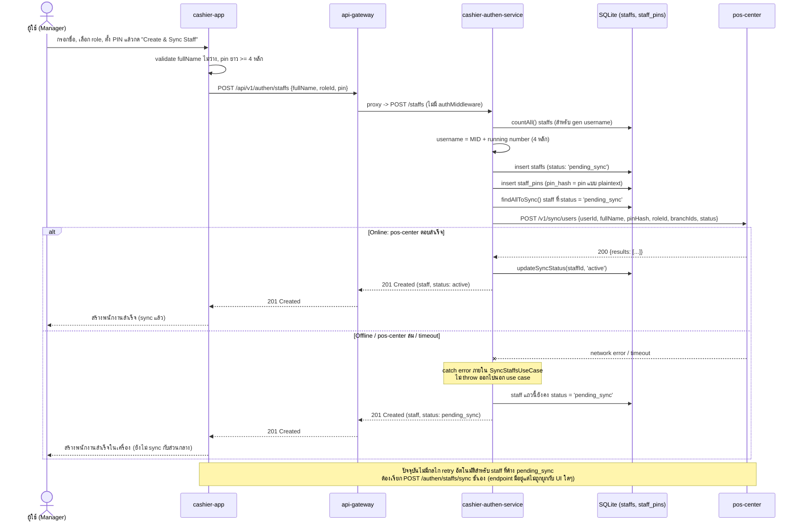

# Staff — create — offline mode / online mode

[← กลับไปหน้ารวม](./README.md)

บันทึกพนักงานลง SQLite local ก่อนเสมอ (`status: 'pending_sync'`) แล้ว**พยายาม sync ไป `pos-center` ทันทีแบบ synchronous ในคำขอเดียวกัน** (ไม่ใช่ outbox worker แบบ product และไม่ใช่ BullMQ queue แบบ order/transaction) หาก sync สำเร็จจะอัปเดตสถานะเป็น `active` ทันที หาก sync ล้มเหลว (offline หรือ `pos-center` ล่ม) exception จะถูก catch ไว้ภายใน `SyncStaffsUseCase` เอง — request ยังคง response `201 Created` กลับไปให้ผู้ใช้เสมอ โดยพนักงานที่เพิ่งสร้างจะค้างสถานะ `pending_sync` ต่อไป

**ข้อควรระวัง (ต่างจาก flow อื่นในระบบนี้):**

- **ไม่มี retry อัตโนมัติ** — ต่างจาก product (`OutboxWorker` retry ทุก 30s) และ order/transaction (BullMQ backoff) กรณี sync staff ล้มเหลวจะไม่มีอะไรลองใหม่ให้อัตโนมัติ ต้องเรียก `POST /authen/staffs/sync` ซ้ำเอง (endpoint นี้มีอยู่จริงทั้งฝั่ง backend และ `ApiStaffRepository.syncStaffs()`/`SyncStaffUseCase` ฝั่ง frontend แต่**ปัจจุบันไม่มีปุ่มหรือจุดใดในหน้าจอเรียกใช้งาน** — เป็น dead code ที่ยังไม่ได้ผูก UI)
- **PIN ไม่ได้ถูก hash** — แม้ field/variable จะตั้งชื่อว่า `pinHash` ทั้งใน DB (`staff_pins.pin_hash`) และโค้ด แต่ค่าที่บันทึกจริงคือ PIN แบบ plaintext ที่รับมาจาก request ตรงๆ ไม่มีการเข้ารหัสใดๆ
- **ไม่มี auth middleware** คุ้มครอง route `POST /staffs` ต่างจาก products service ที่มี `authMiddleware` ตรวจ JWT ก่อนเสมอ

